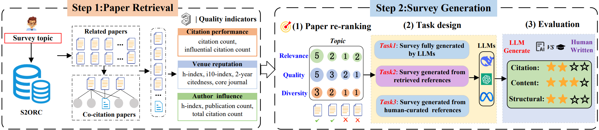

# SurveyGen: Quality-Aware Scientific Survey Generation with Large Language Models



This is the official repository for the dataset and code of the paper:  ["SurveyGen: Quality-Aware Scientific Survey Generation with Large Language Models"](https://arxiv.org/abs/2508.17647),  *accepted at **EMNLP 2025** (Main Conference)*.


## 📂 SurveyGen

Our dataset is constructed based on resources from [S2ORC](https://allenai.org/data/s2orc) (Lo et al., 2020) and [OpenAlex](https://openalex.org/) (Priem et al., 2022).  
The dataset can be accessed at:  [SurveyGen (Google Drive)](https://drive.google.com/drive/folders/1ky6FAd2rs9XPjmOrTMScPbPu_tBv4veh?usp=sharing)  

It contains three files:  

- **survey_full_text**: Parsed full texts of the surveys.  
- **references_for_surveys**: Metadata of the references directly cited in the surveys (named *first-level references*). 
- **second_level_references**: Metadata of the references cited by the first-level references.  

## 💻 Code for QUAL-SG

**Note:**  
- Edit `example/topic.csv` to set the topic, year range, and `max_ref` (maximum number of references).  
- Ensure you have access to an LLM API, e.g. [OpenAI](https://platform.openai.com/), [Google Gemini](https://ai.google/discover/gemini/), or [Anthropic Claude](https://www.anthropic.com/claude).  

**Quick start:**  
1. Run `paper_retrieval.py` – retrieve topic-related papers from Semantic Scholar; output is a json file (DOI, title, abstract, etc.).  
2. Run `quality_signal_augmentation.py` – enrich these papers with quality indicators from OpenAlex (citations, author h-index, venue metrics); output is an augmented metadata json file. 
3. Run `paper_reranking.py` – re-rank the candidate papers and filter them down to `max_ref`; output is a ranked CSV file with selected references.  
4. Run `outline_generation.py` – generate the survey outline based on the selected references; output is an outline file (structured sections/subsections).  
5. Run `survey_generation.py` – generate the full survey text following the outline; output is a draft survey document.  
6. Run `evaluation.py` – evaluate the generated survey (automatic metrics + optional human review); output is an evaluation report.  

**Requirements:** 

- `Python==3.8`  
- `pandas==1.3.5`  
- `sentence-transformers==2.2.2`  
- `scikit-learn==1.0.2`  
- `openai==1.39.0`  
- `rouge-score==0.1.2`  
- `numpy==1.21.5`
  
##  License
SurveyGen is released under the [Creative Commons Attribution-NonCommercial 4.0 International (CC BY-NC 4.0)](https://creativecommons.org/licenses/by-nc/4.0/legalcode) license.  The dataset follows the same policy as [S2ORC](https://allenai.org/data/s2orc) and [OpenAlex](https://openalex.org/): for non-commercial academic research use only.


## Citation

If you use this dataset, please cite the following works:

```bibtex

@inproceedings{surveygen,
  author    = {Tong Bao and Mir Tafseer Nayeem and Davood Rafiei and Chengzhi Zhang},
  title     = {SurveyGen: Quality-Aware Scientific Survey Generation with Large Language Models},
  booktitle = {Proceedings of the 2025 Conference on Empirical Methods in Natural Language Processing (EMNLP)},
  year      = {2025},
  address   = {Suzhou, China}
}
